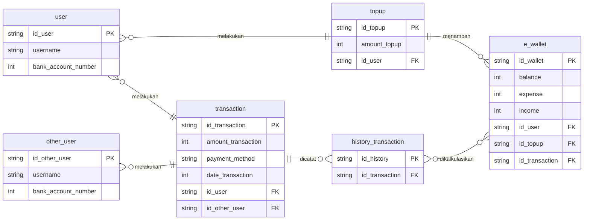

# ERD E-WALLET

```mermaid
  erDiagram
  direction LR
    user }o--|| topup: "melakukan"
    user }o--|| transaction: "melakukan"
    user {
      string id_user PK
      string username
      int bank_account_number
    }
    topup ||--o{ e_wallet: "menambah"
    topup {
      string id_topup PK
      int amount_topup
      string id_user FK
    }
    e_wallet {
      string id_wallet PK
      int balance
      int expense
      int income
      string id_user FK
      string id_topup FK
      string id_transaction FK
    }
    history_transaction }o--o{ e_wallet: "dikalkulasikan"
    transaction {
      string id_transaction PK
      int amount_transaction
      string payment_method
      int date_transaction
      string id_user FK
      string id_other_user FK
    }
    transaction ||--o{ history_transaction: "dicatat"
    history_transaction {
      string id_history PK
      string id_transaction FK
    }
    other_user }o--|| transaction : "melakukan"
    other_user {
      string id_other_user PK
      string username
      int bank_account_number   
    }
```